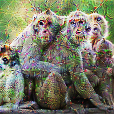

# Deep Dream

This is an implementation of [deepdream](https://github.com/google/deepdream).

# Demo

I took a trained ResNet-34 and used it to mess with a picture of some monkeys. Here's what happens when we try to maximize four different spots (from least to most deep):

